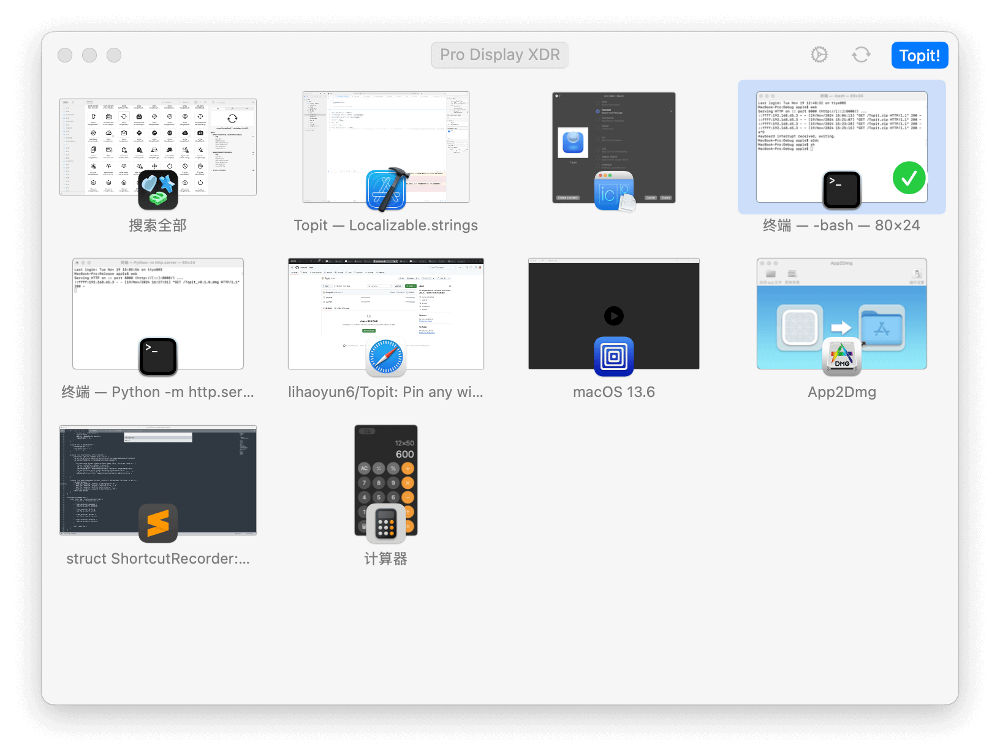

# 

<h1 align="center">Topit</h1>
<h3 align="center">Pin any window to the top of your screen  

## Screenshots

<picture>
  <source media="(prefers-color-scheme: dark)" srcset="./img/preview_dark.png">
  <source media="(prefers-color-scheme: light)" srcset="./img/preview.png">
  
</picture>

## Installation and Usage
### System Requirements:
- macOS 14.0 and Later (15.0 and Later is not valid due to API difference)  

### Installation:
Download the latest installation file [here](../../releases/latest) or install via Homebrew:  

### Usage: 
- Topit can pin windows from any application to the top of your workspace.  

- Just open Topit and select the window you want to pin, and it will do the rest.  
- Topit can pin any number of windows. You can move, resize or interact with them at any time.  

## Q&A
**1. Why does Topit need screen recording and accessibility permissions?**
> Topit uses the accessibility permissions and screen recording permissions to control and capture your windows.  

**2. Does Topit consume a lot of power?**
> Topit uses ScreenCapture Kit to capture windows with a lower CPU overhead. But it may still drain the battery faster when you pin too many windows. 
